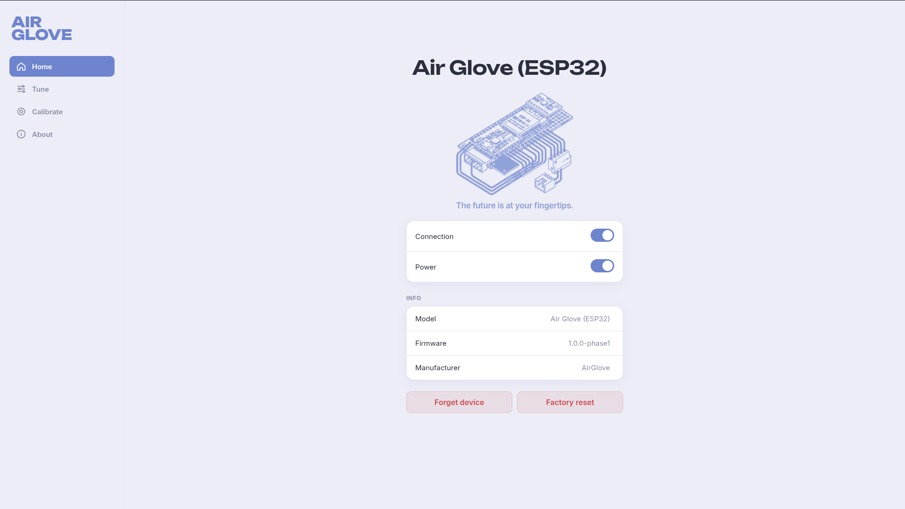
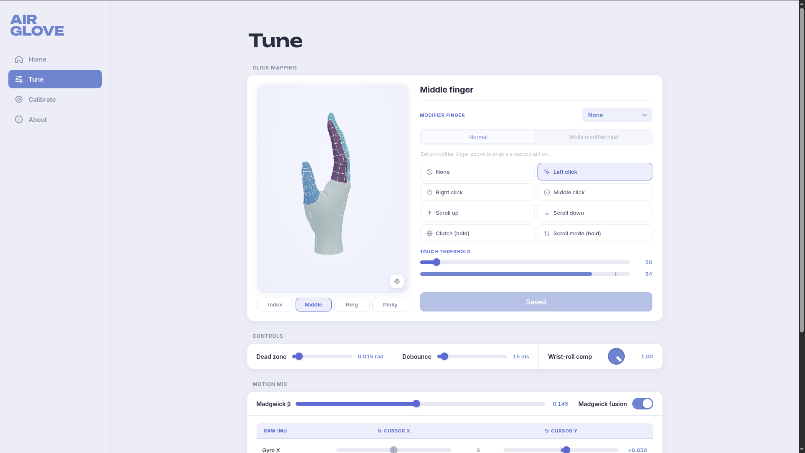

## PBL IoT 2026 — AirGlove

A wearable air-mouse prototype: hand motion captured by an MPU6050/MPU6500 IMU on an ESP32, translated to cursor movement and clicks, and delivered to any host as a Bluetooth HID device.

### Companion app

